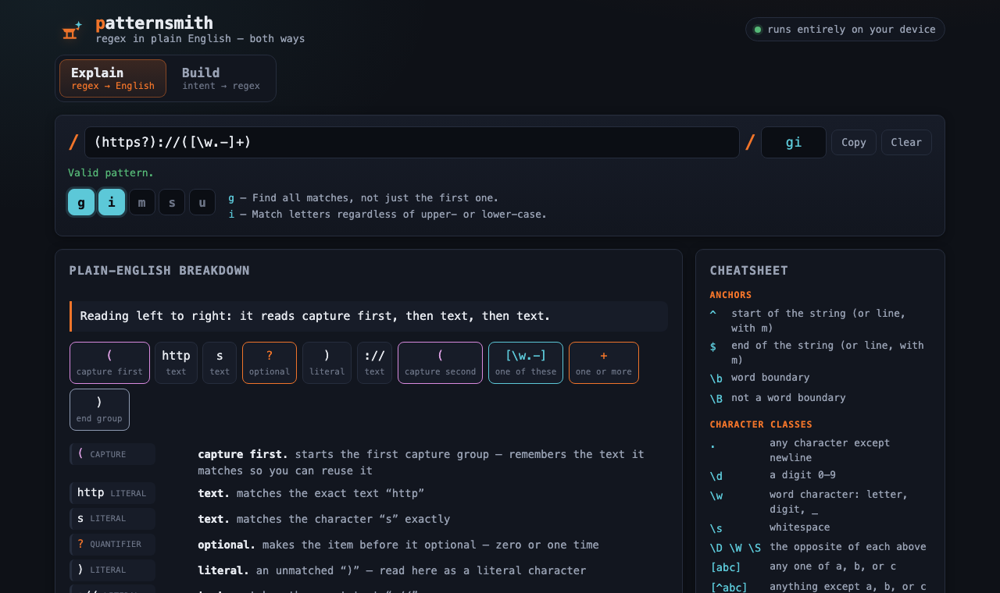

# patternsmith

A regex tool that speaks plain English in **both directions** — read any pattern back token by token, or forge a new one from what you actually want to match.



## Why it exists

Regular expressions are write-once, read-never. You paste one from a Stack Overflow answer, it works, and six months later nobody — including you — can say what it does or safely change it. Most online testers only tell you *whether* it matched, not *why*.

patternsmith closes that gap from both sides. **Explain** takes a regex and narrates every anchor, class, quantifier, group and backreference in plain words, with a one-line summary. **Build** goes the other way: pick an intent (email, URL, ISO date, phone, UUID…) or stack composable blocks, and watch a working pattern assemble itself, each step narrated. A live tester highlights matches, fills a captured-groups table, and previews replacements as you type — and it all runs on your machine, so you can paste real data without it leaving the browser.

## Quickstart

```bash
npm install     # install dependencies
npm run dev     # local dev server with hot reload
npm run build   # build the static site to ./dist/
```

`npm run preview` serves the production build locally. The site is fully static and deploys under a base path (GitHub Pages); every asset and link is referenced through `import.meta.env.BASE_URL`, so nothing 404s under the base.

## How it stays safe

- **100% client-side.** Native `RegExp` only. A strict Content-Security-Policy with `connect-src 'none'` is enforced via a `<meta>` tag — nothing you type is ever sent anywhere. Your pattern and sample live in the URL hash, so a link is shareable without a server.
- **Can't hang the page.** Matching runs in a Web Worker behind a wall-clock time cap. A catastrophic-backtracking pattern such as `/(a+)+$/` gets the worker terminated and a friendly *"too slow"* message instead of a frozen tab.

## Disclaimer

This software is provided **"as is", without warranty of any kind**, express or implied. It is a learning and productivity aid, not a validation authority: **verify every generated or explained pattern against your own real inputs before relying on it in production.** Regex behaviour varies across engines, and an explanation or a generated pattern may not fit your exact case. To the maximum extent permitted by law, the author accepts **no liability** for any loss or damage arising from use of this tool or the patterns it produces. See [`LICENSE`](./LICENSE) for the full MIT terms.

## License

MIT © 2026 Sreenivas Sadhu Prabhakara. See [`LICENSE`](./LICENSE).
